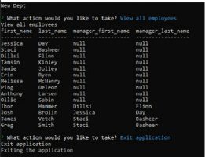

# Employee Content Management System (CMS)

# Description

The purpose of this project was to develop a command line interface to manage information related to employees stored in a database. The application allows the user to view, insert, edit and update information in the databese from the command line interface.

# Installation

To use this readme employee CMS appliation you must install node, the inquirer package, the console.table package, MySQL2 package and clone the code from this repository into your own directory.

Install Node: [Node.js](https://nodejs.org/en/download/).

Install Inquirer package: [Inquirer](https://www.npmjs.com/package/inquirer).

Install console.table package: [console.table](https://www.npmjs.com/package/console.table).

Install MySQL2 package: [MySQL2](https://www.npmjs.com/package/mysql2).

# Appearance

# Usage

Use this program to track and view employee information. The application databse has the following information fields:

Department

- id: INT PRIMERY KEY
- name: VARCHAR(30)

Role

- id: INT PRIMARY KEY
- title: VARCHAR(30)
- salary: DECIMAL
- department_id: INT

Employee

- id: INT PRIMARY KEY
- first_name: VARCHAR(30)
- last_name: VARCHAR(30)
- role_id: INT
- manager_id: INT

## Link to video demonstration

Video demo: [GDrive Link](https://drive.google.com/file/d/1TSw8JEd1tat7lPRtbVF2nIy-_Gh1gAnm/view?usp=sharing)

## Credits

Credits to Node.js, Inquirer package, console.table package, MySQL2.
